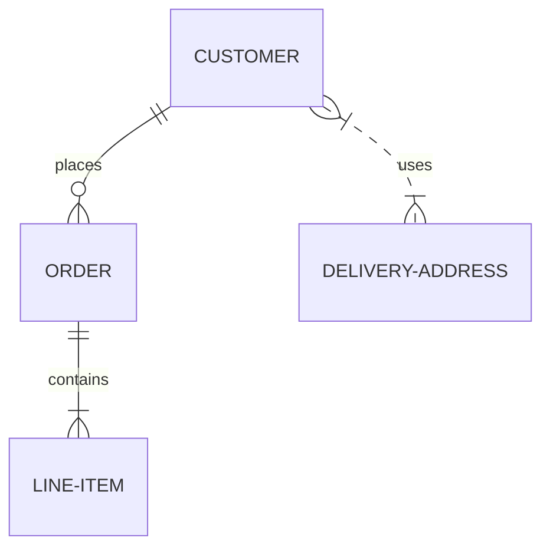

## Диаграмм Mermaid.js
Появилась возможность вставлять диаграммы [Mermaid.js](https://mermaid-js.github.io/mermaid/#/)

<pre>
```mermaid
... код диаграммы ...
```
</pre>
Пример:
<pre>

</pre>

Очень подробно на русском языке о диаграммах Mermaid.js: https://habr.com/ru/post/652867/ 

[:arrow_up:Оглавление](#Оглавление) 
____

